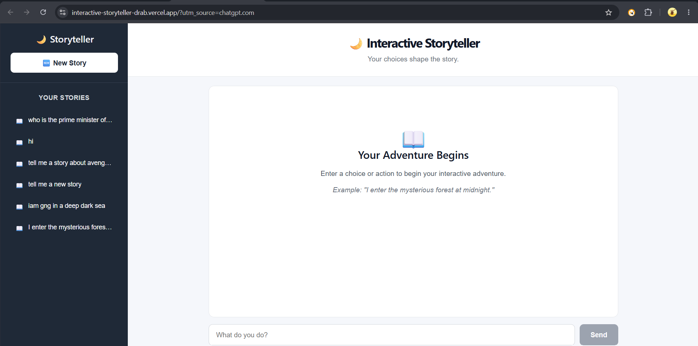
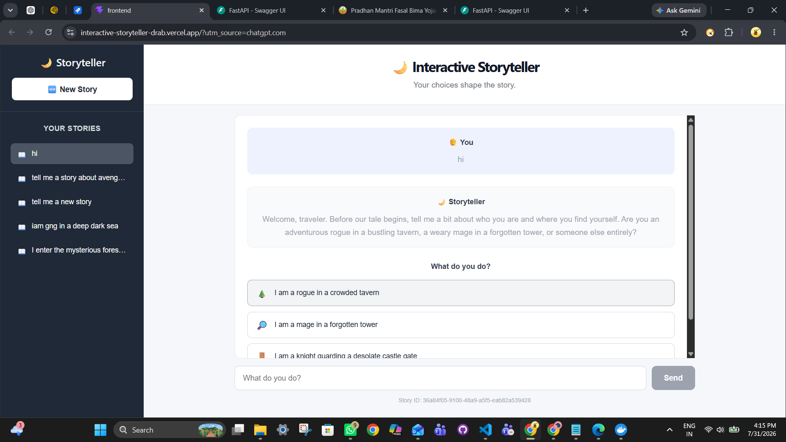
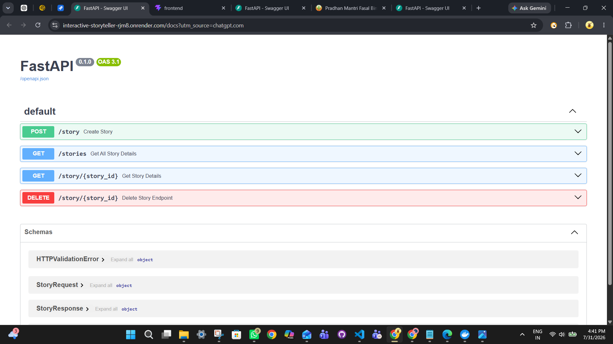

# 🌙 Interactive Storyteller

An AI-powered interactive storytelling application where users can create and continue dynamic stories by making choices and taking actions. The AI storyteller maintains conversation history and persistent story state to provide a continuous and personalized adventure.

## 📌 Problem Statement

Traditional storytelling provides a fixed narrative where readers have limited influence over how the story develops.

The Interactive Storyteller solves this problem by using Generative AI to create an interactive, multi-turn storytelling experience. Users can enter actions, make decisions, and follow AI-generated choices that influence the progression of the story.

The application maintains story context, conversation history, and important story information so that users can continue their stories across multiple interactions.

## ✨ Features

- AI-generated interactive stories
- Multi-turn conversations
- Dynamic story continuation
- AI-generated choices for users
- Persistent story state
- Conversation history
- Create multiple stories
- Continue previously created stories
- Delete stories
- Story history sidebar
- FastAPI backend
- React frontend
- SQLite database
- Gemini Generative AI integration
- Dockerized backend
- Environment variable based API key management
- REST API architecture
- Public cloud deployment

## 🏗️ Application Architecture

```text
User
  │
  ▼
React + Vite Frontend
  │
  │ REST API
  ▼
FastAPI Backend
  │
  ├──────────────► Gemini AI API
  │
  ▼
SQLite Database
  │
  └── Story State
  └── Conversation History

  ## 📸 Screenshots

### Main Interface

The main Interactive Storyteller interface where users can start a new story, view existing stories, and interact with the AI storyteller.



### Deployed Application

The deployed Interactive Storyteller application running on the public Vercel URL.



### API Documentation

FastAPI Swagger UI showing the available backend API endpoints used by the Interactive Storyteller application.

